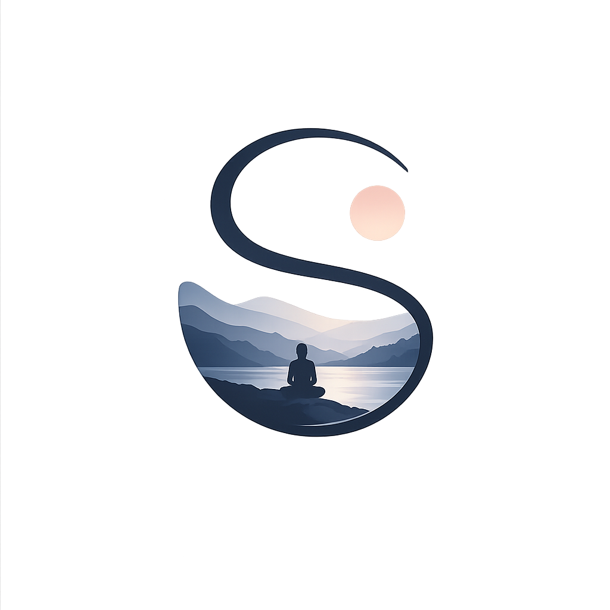
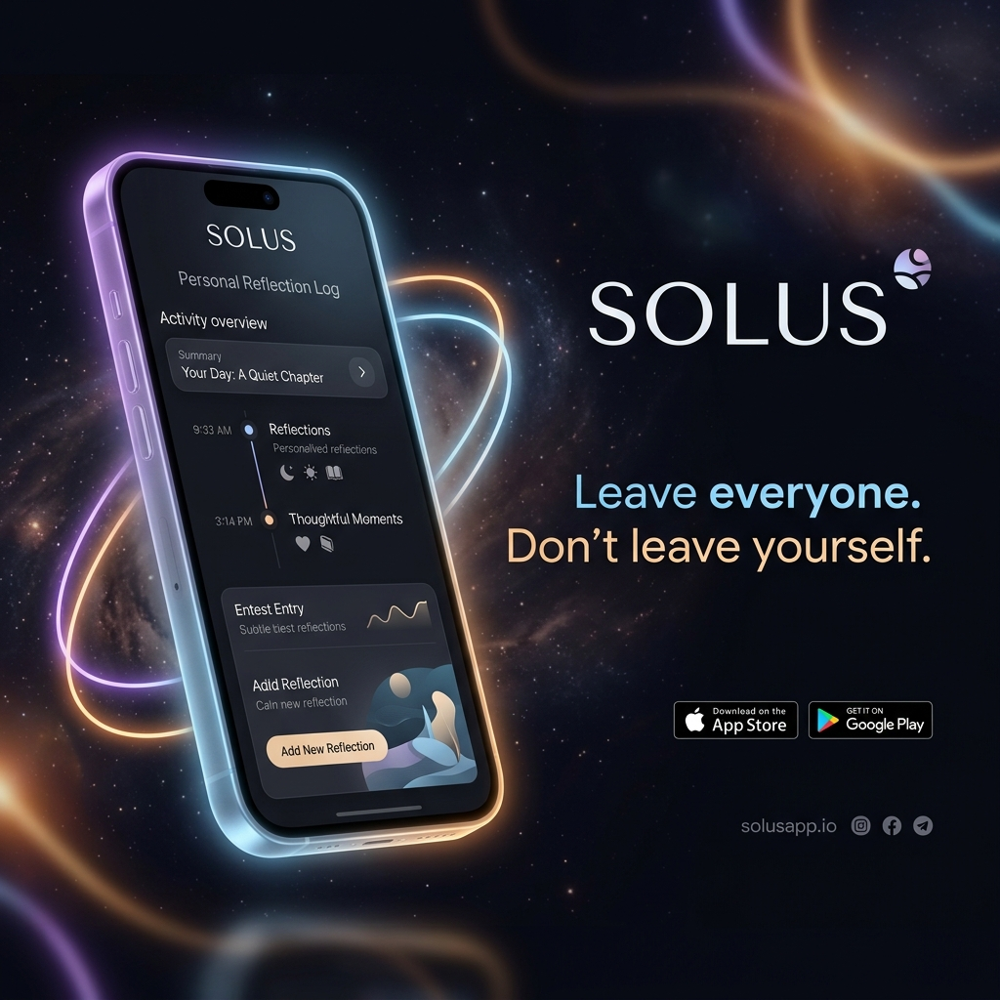
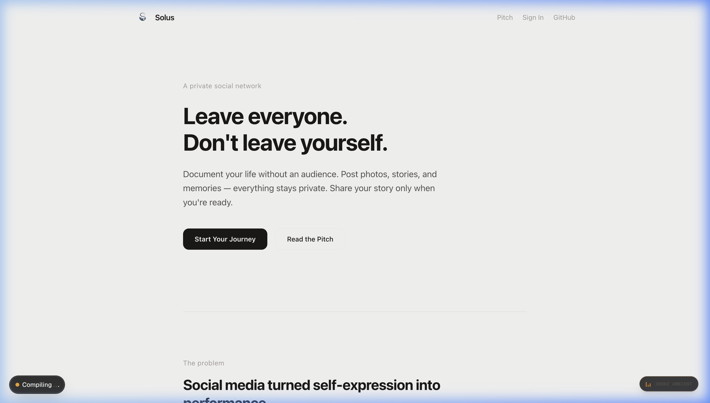
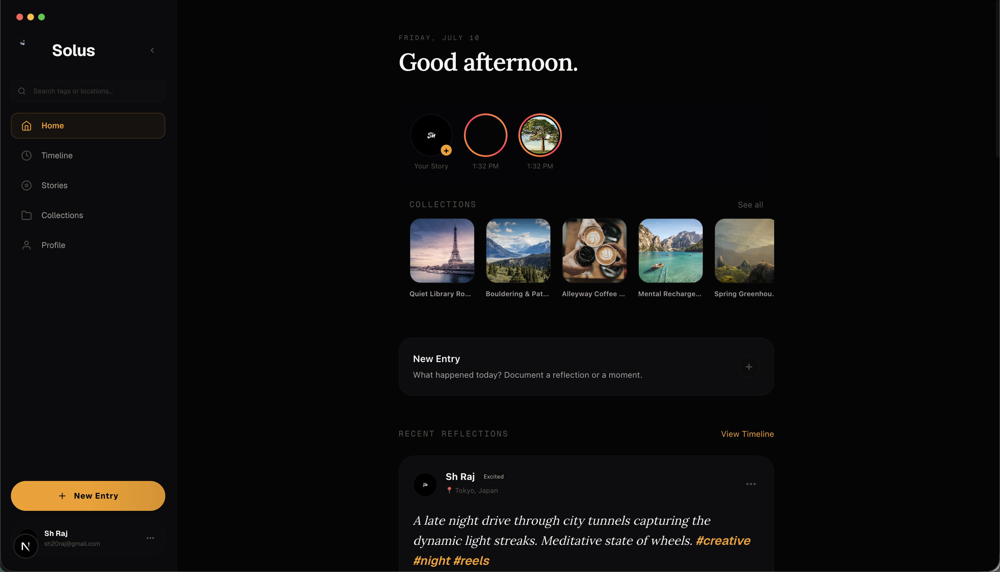
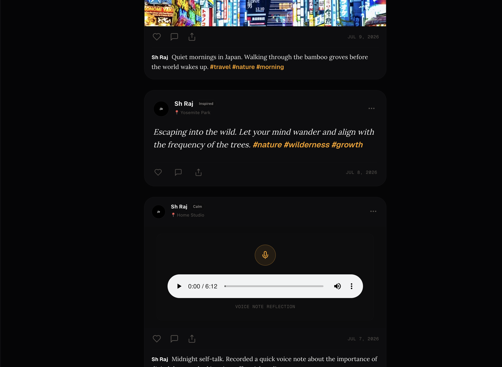
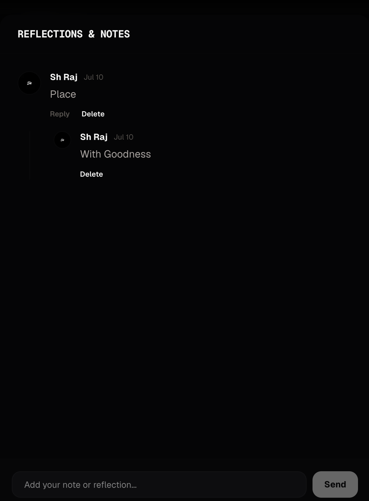
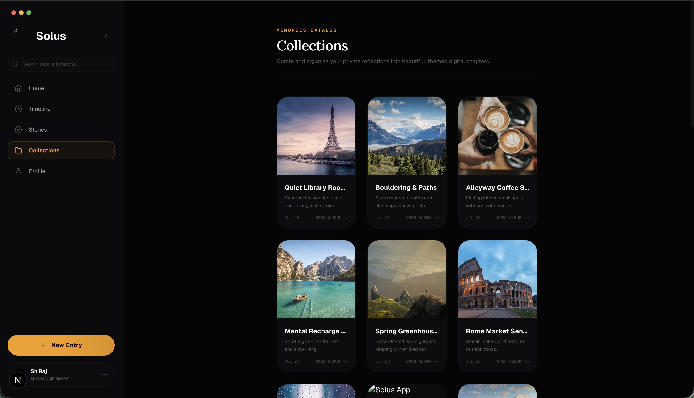
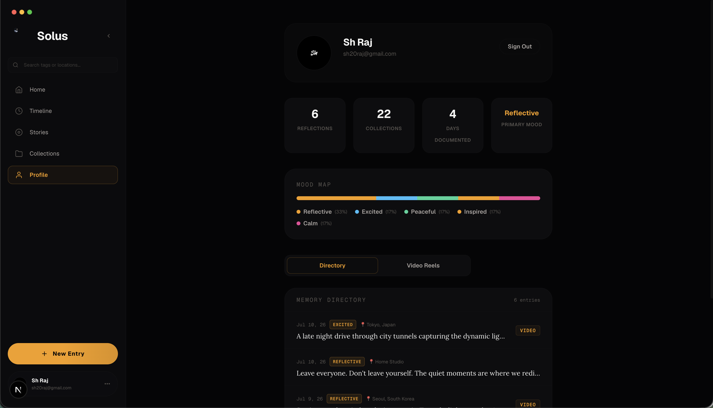
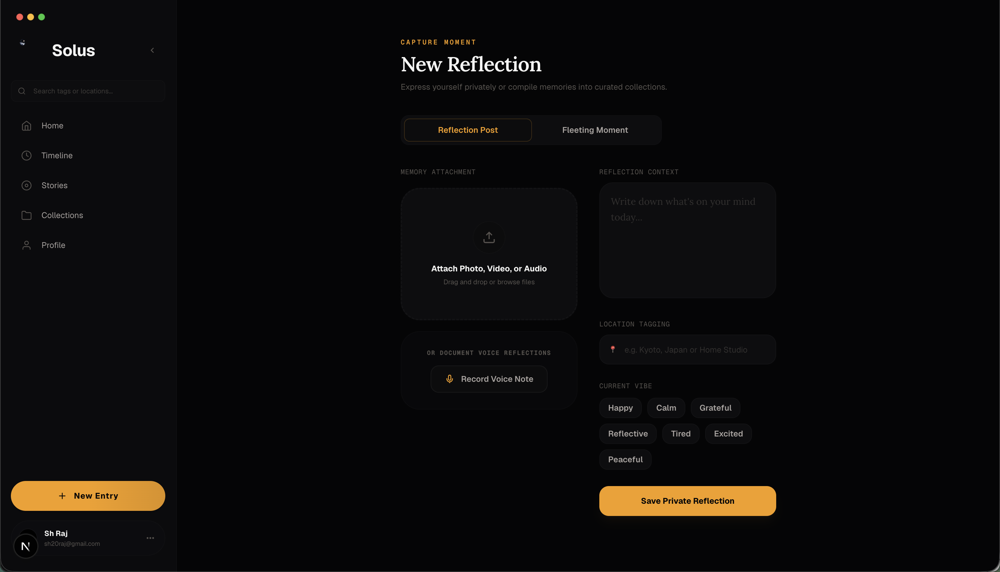

<p align="center">
  
</p>

<h1 align="center">Solus</h1>

<p align="center">
  <strong>Leave everyone. Don't leave yourself.</strong>
</p>

<p align="center">
  
</p>

<p align="center">
  A private social network where you document your life without an audience — and share your story only when you're ready.
</p>

<p align="center">
  <a href="https://solus.shraj.workers.dev">🌐 Live Demo</a> •
  <a href="#vision">💡 Vision</a> •
  <a href="#features">✨ Features</a> •
  <a href="#use-cases">🎯 Use Cases</a> •
  <a href="#getting-started">🚀 Getting Started</a>
</p>

<p align="center">
  
  
  
  
  
</p>

---

## Vision

Today's social media encourages people to document life for an audience. Every photo, story, and post is influenced by likes, comments, followers, and algorithms.

**Solus removes the audience.**

It gives you a familiar social-media experience — post stories, photos, videos, thoughts, and memories — but everything is **private by default**. The goal isn't to disconnect from life. It's to disconnect from the pressure of being watched.

> *Instagram asks: "What will people think?"*
> *Solus asks: "What do you think?"*

---

## The Problem

Modern social media has shifted from self-expression to performance. People ask themselves:

- *Will this get likes?*
- *Is this aesthetic enough?*
- *What will people think?*

Eventually, people stop living moments naturally and start **creating moments for social media**. Some deactivate every account because they need peace — but then lose the habit of documenting their lives altogether.

**There is no product that lets people continue documenting their lives without an audience. Until now.**

---

## The Solution

Solus is a **personal social network**. Everything works like a familiar social media app, except there is no audience.

- 🔒 **Private by default** — No one can discover, follow, like, comment, or message
- 📸 **Post freely** — Photos, videos, captions, stories, memories
- 📅 **Personal timeline** — Your life's story, for your eyes only
- 🌍 **Share when ready** — Optionally publish posts, journeys, or your entire profile
- ⏰ **Scheduled publishing** — Set a future date; visitors see *"This page will become public on [date]"*
- 🔗 **Secret links** — Share with specific people before going public

---

## Features

| Feature | Description |
|---------|-------------|
| **Private Profile** | Everything you post is private by default |
| **Photo & Video Posts** | Upload and caption your moments |
| **Stories** | Ephemeral content, just for you |
| **Personal Timeline** | A beautiful chronological record of your life |
| **Journey Mode** | Group posts into themed journeys (*"30 Days in Ladakh"*) |
| **Optional Sharing** | Publish a post, a journey, or your whole profile |
| **Scheduled Publishing** | Auto-publish on a future date |
| **Shareable Links** | Send private links to friends & family |
| **Time Capsules** | Post today, unlock after 30 days / 1 year / 10 years |
| **Letters to Future Self** | Write messages to your future self |
| **Offline Mode** | Works offline, syncs later — perfect for mountains |

---

## Core Principles

```
✦ Private by default       ✦ No followers
✦ No likes                 ✦ No comments
✦ No algorithms            ✦ No pressure
✦ No performance           ✦ Just memories
```

---

## Use Cases

| Who | How They Use Solus |
|-----|-------------------|
| 🏔️ **Solo Travelers** | Document a 45-day Nepal trip privately, publish *"45 Days Across Nepal"* later |
| 🚀 **Startup Founders** | Record wins, failures, product screenshots — publish *"Building XYZ from Day 1"* at launch |
| 💪 **Fitness Journeys** | Daily selfies, weight, meals — publish *"Lost 30 kg"* after 6 months |
| 📚 **Students** | Track JEE/UPSC/CAT prep privately, publish the journey after selection |
| 🎹 **Learners** | Piano Day 1 → Day 300 — one beautiful timeline |
| 👶 **Parents** | Baby milestones — private forever, or publish after years |
| 🧘 **Retreats** | Meditation & yoga retreat reflections, publish later |
| 💔 **Healing** | Private voice notes & thoughts — publish *"365 Days After My Breakup"* when ready |

---

## Why Solus Is Different

| | Instagram | Solus |
|---|-----------|-------|
| **Designed for** | Attention | Reflection |
| **Rewards** | Engagement | Authenticity |
| **Default** | Public | Private |
| **Purpose** | Share your life | Keep your life |
| **Order** | Experience → Edit → Post | Experience → Capture → Reflect → Share later |

---

## Tech Stack

- **Framework**: [Next.js 16](https://nextjs.org) (App Router)
- **Styling**: [Tailwind CSS 4](https://tailwindcss.com)
- **Language**: [TypeScript 5](https://typescriptlang.org)
- **Deployment**: [Cloudflare Workers](https://workers.cloudflare.com) via [OpenNext](https://opennext.js.org/cloudflare)
- **Runtime**: Edge-first, globally distributed

---

## Getting Started

### Prerequisites

- [Bun](https://bun.sh) (recommended) or Node.js 18+

### Development

```bash
# Clone the repository
git clone https://github.com/SH20RAJ/solus.git
cd solus

# Install dependencies
bun install

# Start development server
bun run dev
```

Open [http://localhost:3000](http://localhost:3000) to see the app.

### Preview (Cloudflare Runtime)

```bash
bun run preview
```

### Deploy

```bash
bun run deploy
```

Deploys to [solus.shraj.workers.dev](https://solus.shraj.workers.dev).

---

## Screenshots

<p align="center">
  
  
</p>
<p align="center">
  
  
</p>
<p align="center">
  
  
</p>
<p align="center">
  
</p>

---

## One-Sentence Pitch

> **Solus is a private social network where you can document your life without an audience and choose to share your story only when you're ready.**

---

## Philosophy

*The internet taught us to perform for others. It's time to live for ourselves.*

Social media made us perform for others. Solus helps people **live for themselves**.

---

<p align="center">
  Made with 💜 by <a href="https://github.com/SH20RAJ">SH20RAJ</a>
</p>
