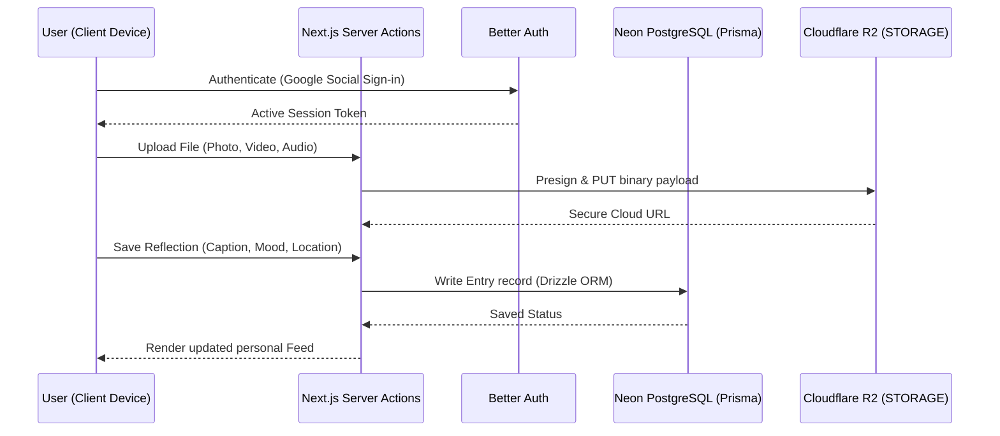

# Solus Pitch Deck: The Personal Social Network

## 1. Product Philosophy

Solus is intentionally simple. Every feature reinforces the core idea: **Live first. Share later.**

Traditional platforms create a performance loop. Solus is a sanctuary—your personal diary styled with the familiarity of a modern social network.

---

## 2. Market Pain & Scientific Context

Recent clinical research demonstrates the mental toll of the attention economy:

* **16.1% Reduction in Anxiety Symptoms** after a one-week social media break.
* **24.8% Decrease in Depressive Symptoms** when validation loops are paused.
* **86% of Young Adults** feel intense pressure to curate perfect profiles for an audience.

Solus is the **third option**: document your life natively without the pressure of an audience.

---

## 3. Product Architecture

---

## 4. Competitive Matrix

| Feature | Solus | Instagram / Threads | Day One (Diary) |
| :--- | :---: | :---: | :---: |
| **Validation Metrics (Likes/Followers)** | ❌ None | ⚠️ Core Hook | ❌ None |
| **Ad Targeting & Scraped Data** | ❌ Zero | ⚠️ Core Business | ❌ None |
| **Familiar Feed Layout** | ✅ Modern Feed | ✅ Modern Feed | ❌ Plain List |
| **Voice Note Recording** | ✅ Integrated | ⚠️ Group Chat Only | ⚠️ Premium Only |
| **Open Sharing (Opt-in Links)** | ✅ Easy Links | ✅ Forced Public | ❌ App Locked |

## 5. Business Model

* **Free**: Unlimited personal memories.
* **Premium**:
  * **AI Assistant Lyra** (private cognitive journaling assistant).
  * AI memory organization and layout grouping.
  * Beautiful journal book PDF exports.
  * Multi-device private backups and family vaults.
  * Extra cloud storage space.

---

## 6. Technology Stack

* **Frontend**: Next.js 16 (App Router), React 19, Tailwind CSS.
* **Backend**: Server Actions, Drizzle ORM, Neon PostgreSQL, Cloudflare R2 Storage.
* **Auth**: Better Auth (Google Sign-In only).
